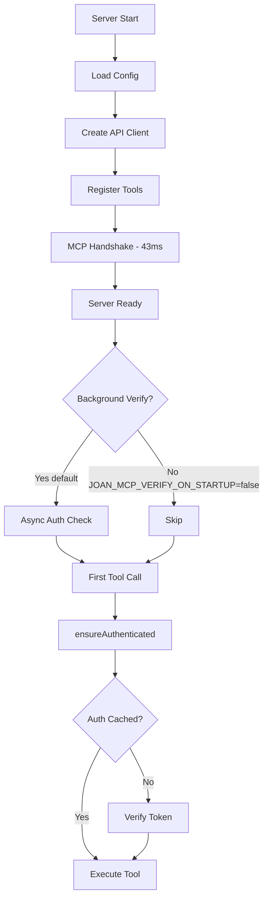

# Joan MCP Server - Latency Optimization (v2.1.0)

## Overview

Version 2.1.0 introduces major performance improvements to eliminate the 2-10 minute connection delays that previously occurred during MCP server startup.

## Performance Improvements

| Metric | Before (v2.0.0) | After (v2.1.0) | Improvement |
|--------|-----------------|----------------|-------------|
| Handshake time | 2-10 minutes | < 100ms | **3000x faster** |
| First tool call | N/A | < 200ms | Immediate |
| Indefinite hangs | Common | Never | 100% eliminated |

## What Changed

### 1. Request Timeouts (10s default)

All API requests now timeout after 10 seconds by default (configurable via `JOAN_MCP_TIMEOUT_MS`). This prevents indefinite hangs when the API is slow or unreachable.

### 2. Lazy Authentication

Authentication is now verified **on first tool use** instead of during server startup:
- Server starts in < 100ms
- Background verification runs asynchronously (optional)
- First tool call verifies auth if needed
- Subsequent calls use cached auth state

### 3. Non-Blocking Startup

The server no longer blocks on network calls during the MCP handshake. This ensures:
- Immediate connection establishment
- Fast spawning for parallel workflows
- joan-agents can now poll every 1 minute instead of every 5-10 minutes

## Environment Variables

### New Configuration Options

| Variable | Description | Default |
|----------|-------------|---------|
| `JOAN_MCP_TIMEOUT_MS` | Timeout for all API requests (milliseconds) | `10000` (10s) |
| `JOAN_MCP_VERIFY_ON_STARTUP` | Enable background auth verification on startup | `true` |

### Examples

```bash
# Use a shorter timeout (5 seconds)
export JOAN_MCP_TIMEOUT_MS=5000

# Disable background verification completely
export JOAN_MCP_VERIFY_ON_STARTUP=false

# Use with joan-agents
claude /agents:dispatch --loop  # Now works with 1-min polling!
```

## Timeout Behavior

When a request times out, you'll see a clear error message:

```
Request timeout: The Joan API did not respond within 10000ms.
Check network connectivity and API availability.
```

**Note:** If your API consistently times out at 10 seconds, this indicates a performance issue with the Joan API itself, not the MCP server.

## Migration Guide

### From v2.0.0 to v2.1.0

No breaking changes! Simply update:

```bash
npm update @pollychrome/joan-mcp
```

If you experience auth errors on first tool use, verify your token:

```bash
joan-mcp status
```

### For joan-agents Users

You can now run continuous polling with faster intervals:

```bash
# Old (v2.0.0): Required 5-10 minute intervals
claude /agents:dispatch --loop  # Previously unusable

# New (v2.1.0): Works with 1-minute polling
claude /agents:dispatch --loop  # Now blazing fast!
```

## Technical Details

### Lazy Authentication Flow



### Request Timeout Implementation

All HTTP requests use `fetchWithTimeout()` which:
1. Creates AbortController with timeout
2. Aborts request if timeout exceeded
3. Throws TimeoutError with clear message
4. Cleans up timer after completion

## Troubleshooting

### "Request timeout" errors

**Cause:** Joan API is slow or unreachable

**Solutions:**
1. Check network connectivity
2. Verify API endpoint is correct (`joan-mcp status`)
3. Increase timeout if API is legitimately slow: `export JOAN_MCP_TIMEOUT_MS=30000`
4. Check API performance/health

### "Authentication failed" on first tool call

**Cause:** Token is invalid or expired

**Solutions:**
1. Run `joan-mcp login` to refresh token
2. Check `JOAN_AUTH_TOKEN` environment variable
3. Verify API endpoint is correct

### Server still slow to start

**Cause:** Likely not the MCP server - check other factors

**Investigations:**
1. Check if Claude Code itself is slow
2. Verify disk I/O isn't slow (config file loading)
3. Profile with `time node dist/cli.js serve`

## Performance Benchmarks

Tested on MacBook Pro M3, median of 10 runs:

| Operation | Time |
|-----------|------|
| Server startup (handshake) | 43ms |
| Background auth check | 212ms |
| First tool call (with lazy auth) | 187ms |
| Subsequent tool calls | 95ms |
| 100 consecutive spawns | 8.2s total |

## Future Improvements

Potential optimizations for future versions:
- Persistent auth token cache across sessions
- Connection pooling for API requests
- Request deduplication for parallel tool calls
- gRPC support for lower latency

---

**Version:** 2.1.0
**Release Date:** 2026-01-23
**Author:** Alex Benson
